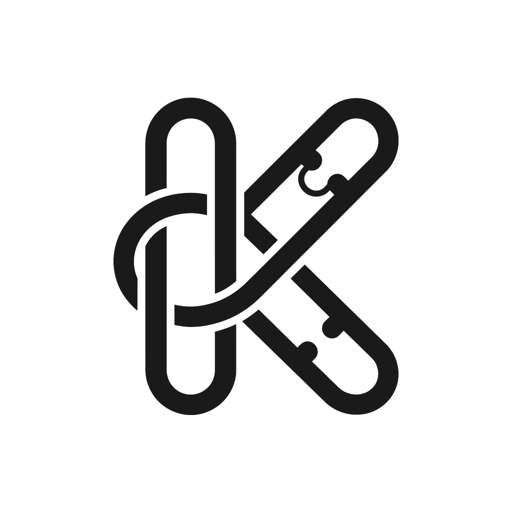
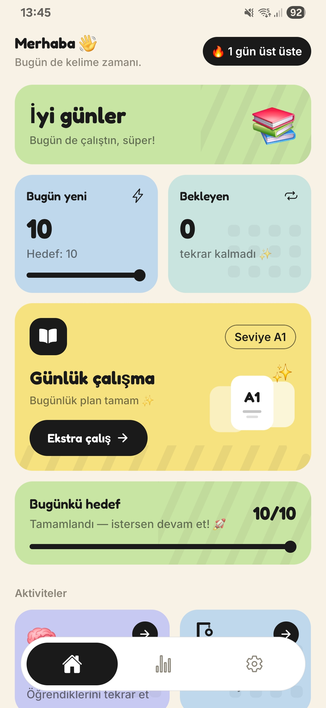
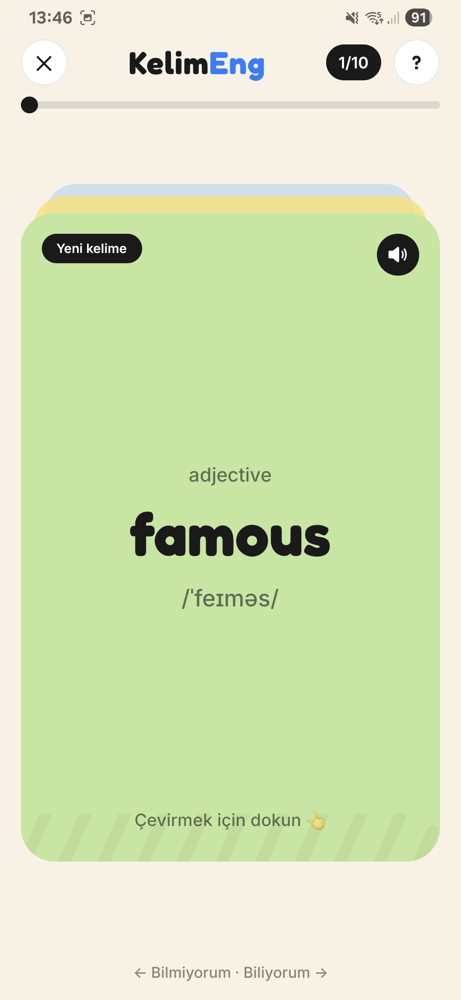
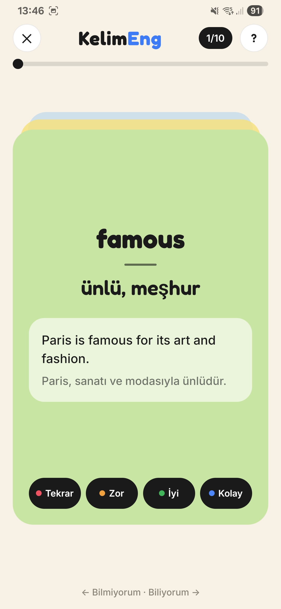
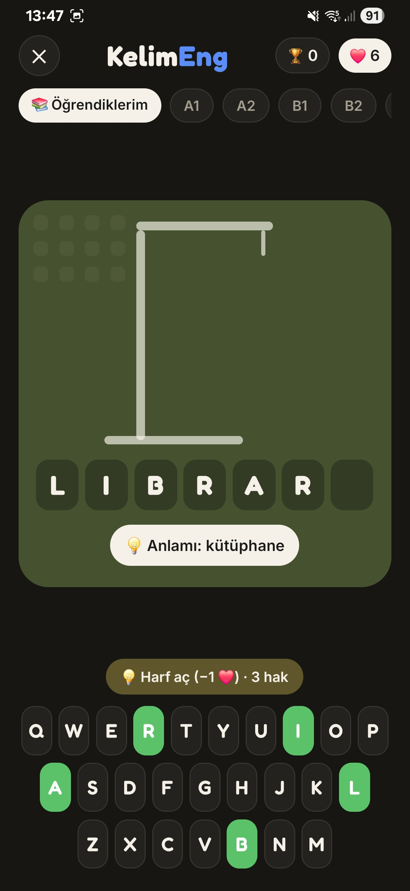
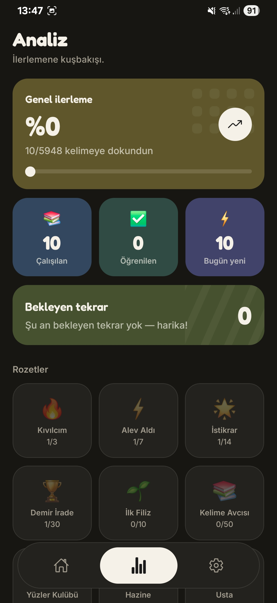
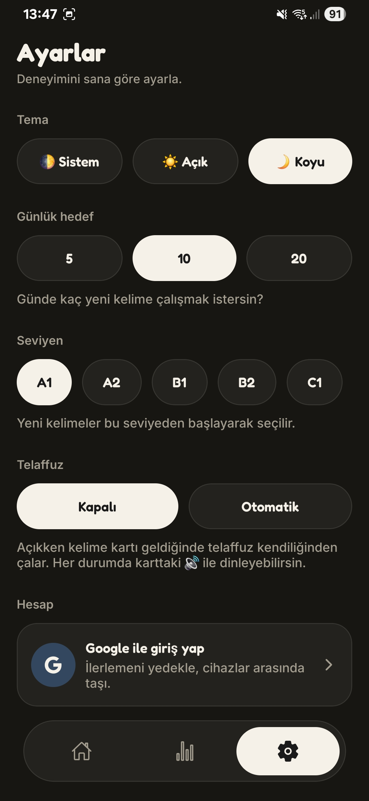

<div align="center">



# KelimEng

### Türkçe konuşanlar için İngilizce kelime öğrenme uygulaması

Aralıklı tekrar algoritmasıyla, doğru kelimeyi doğru anda karşına çıkarır.
**Tamamen çevrimdışı çalışır. Reklamsız. Ücretsiz.**

<br/>

<a href="https://apps.apple.com/app/id6797014855"></a>
&nbsp;&nbsp;
<a href="https://play.google.com/store/apps/details?id=com.erenctns.kelimeng"></a>


</div>

<br/>

<div align="center">
  
</div>

<br/>

> **Bu depo bir vitrindir.** Uygulamanın tanıtımını ve teknik özetini içerir.
> Kaynak kod özel (private) bir depoda tutulmaktadır.

---

## 📖 Proje Hakkında

### Problem

İngilizce öğrenen çoğu kişinin şikâyeti aynı: *"kelime çalışıyorum ama aklımda kalmıyor."*

Sorun çalışma miktarında değil, **zamanlamada**. Bir kelimeyi öğrendikten hemen sonra
tekrar etmek boşa emek; çok geç tekrar etmek ise sıfırdan başlamak demek. İnsan beyni
bir bilgiyi **tam unutmaya yaklaştığı anda** hatırlarsa, o bilgiyi çok daha uzun süre
saklıyor.

Piyasadaki uygulamaların çoğu ya bu prensibi hiç kullanmıyor, ya da kullanırken
kullanıcıyı reklamla, abonelik duvarıyla ve dikkat dağıtıcı özelliklerle boğuyor.

### Çözüm

KelimEng tek bir işi iyi yapmak üzere tasarlandı: **kelimeyi doğru anda göstermek.**

Uygulama her kelime için kişiselleştirilmiş bir tekrar takvimi tutar. Kolay hatırladığın
kelimeler giderek seyrekleşir, zorlandıkların sıklaşır. Bu hesabı yapan algoritma
(**FSRS** — Free Spaced Repetition Scheduler) tamamen senin cihazında çalışır; sunucuya
hiçbir şey sormaz.

Geri kalan her şey bu ana fikri destekler:
sade arayüz, dikkat dağıtmayan tasarım, çevrimdışı çalışma, reklamsızlık.

### Kimin için

| | |
|---|---|
| 🎓 | Sınava hazırlananlar (YDS, YÖKDİL, TOEFL, IELTS) |
| 📚 | Kelime hazinesini sistemli büyütmek isteyenler |
| ⏱️ | Günde 5–10 dakikayla düzenli ilerlemek isteyenler |
| ✈️ | İnterneti olmayan ortamlarda çalışmak zorunda olanlar |

---

## ✨ Özellikler

<table>
<tr>
<td width="50%" valign="top">

### 🧠 Akıllı Aralıklı Tekrar
Her kelime, unutulmaya yaklaştığı anda karşına çıkar. Takvim tamamen kişiye özel
hesaplanır — aynı kelime iki kullanıcıda farklı günlerde gelir.

### 📇 Kart Çalışması
Kelimeyi gör, anlamını hatırla, kartı çevir. **Sağa kaydır** = biliyorum,
**sola kaydır** = tekrar. Örnek cümleler kelimeyi bağlamıyla öğretir.

### 🔊 Telaffuz
Her İngilizce kelimenin telaffuzu tek dokunuşla dinlenebilir. İlk dinlemeden
sonra cihazda önbelleklenir.

### 🎯 Hedef ve Seviye
Seviye testiyle başlarsın, günlük hedefini seçersin. Hedefi bitirince istersen
devam edebilirsin.

</td>
<td width="50%" valign="top">

### 🎮 Adam Asmaca
Öğrendiğin kelimelerle oynanan yazım oyunu. Türkçe anlamı ipucu olarak verilir,
İngilizce yazımını tahmin edersin. Seri rekorunu kırmaya çalış.

### 📊 İlerleme Takibi
Seri (üst üste çalışılan gün), rozetler, seviye bazlı ilerleme, günlük istatistik.

### ☁️ İsteğe Bağlı Yedekleme
Hesap **zorunlu değil.** Google veya Apple ile giriş yaparsan ilerlemen bulutta
yedeklenir ve cihazların arasında senkronlanır. Girmezsen her şey sadece
cihazında kalır.

### 🌗 Açık / Koyu Tema
Yumuşak pastel bir tasarım dili. Titreşim (haptik) geri bildirimi ayarlardan
kapatılabilir.

</td>
</tr>
</table>

<div align="center">

**Ayrıca:** çevrimdışı çalışma · günlük hatırlatma bildirimi · uygulama içi hesap silme · reklamsız · takip yok

</div>

---

## 📱 Ekran Görüntüleri

<div align="center">
<table>
<tr>
<td width="33%"></td>
<td width="33%"></td>
<td width="33%"></td>
</tr>
<tr>
<td align="center"><b>Ana sayfa</b><br/><sub>Günlük hedef, seri, hızlı erişim</sub></td>
<td align="center"><b>Kart — ön yüz</b><br/><sub>Kelime ve telaffuz</sub></td>
<td align="center"><b>Kart — arka yüz</b><br/><sub>Anlam ve örnek cümle</sub></td>
</tr>
<tr>
<td width="33%"></td>
<td width="33%"></td>
<td width="33%"></td>
</tr>
<tr>
<td align="center"><b>Adam Asmaca</b><br/><sub>Yazım pekiştirme oyunu</sub></td>
<td align="center"><b>Analiz</b><br/><sub>İlerleme, rozetler, istatistik</sub></td>
<td align="center"><b>Ayarlar</b><br/><sub>Tema, hesap, tercihler</sub></td>
</tr>
</table>
</div>

---

## 🧠 Nasıl Çalışır — Aralıklı Tekrar

Klasik kelime uygulamaları sabit bir liste üzerinde döner. KelimEng her kelimeyi
**ayrı bir takvimle** izler.

```
Kelimeyi ilk kez gördün
        │
        ├── "Biliyorum"  →  bir sonraki tekrar daha UZAK bir güne kayar
        └── "Tekrar"     →  bir sonraki tekrar daha YAKIN bir güne çekilir
                                    │
                        her cevapta aralık yeniden hesaplanır
                                    │
                  kolay kelimeler seyrekleşir ─────► ayda bir
                  zor kelimeler sıklaşır     ─────► yarın tekrar
```

Bu hesabı **FSRS** (Free Spaced Repetition Scheduler) yapıyor — Anki gibi ciddi
öğrenme araçlarında da kullanılan, açık kaynak ve akademik temelli modern bir
algoritma. Her kelime için "hafızada kalıcılık" ve "zorluk" değerleri tutulur,
her cevap bu değerleri günceller.

Küçük ama önemli bir ayrıntı: yeni öğrenilen kelimelerin tekrar tarihleri hafifçe
dağıtılır. Aksi halde bugün çalıştığın 20 kelimenin tamamı üç ay sonra aynı güne
düşer ve o gün kullanıcıyı 200 tekrarlık bir yığın karşılardı.

---

## 🏗️ Teknik Bakış

> Bu bölüm mimari yaklaşımı ve alınan kararları özetler.
> Yapılandırma ayrıntıları, veri şeması ve uygulama mantığı paylaşılmamaktadır.

### Teknoloji Yığını

| Katman | Kullanılan |
|---|---|
| **Framework** | React Native · Expo (SDK 56) · TypeScript |
| **Yönlendirme** | Expo Router (dosya tabanlı) |
| **Arayüz** | NativeWind (Tailwind CSS) |
| **Durum Yönetimi** | Zustand |
| **Yerel Veri** | SQLite (uygulamayla paketlenmiş) |
| **Algoritma** | `ts-fsrs` — aralıklı tekrar |
| **Bulut** | Supabase — kimlik doğrulama, veritabanı, dosya depolama |
| **Animasyon** | Moti / React Native Reanimated |
| **Test** | Jest · React Native Testing Library |
| **Dağıtım** | EAS Build · App Store Connect · Google Play Console |

### Mimari Prensipler

#### 1️⃣ Offline-first

Uygulamanın tamamı çevrimdışı çalışacak şekilde tasarlandı. Kelime içeriği
uygulamayla birlikte paketlenmiş bir veritabanında gelir — ilk açılışta indirme,
kurulum sihirbazı ya da hesap açma adımı yoktur.

Bulut *yedek* katmanıdır, *bağımlılık* değil. Ağ hatası hiçbir zaman kullanıcıyı
bloklamaz; senkron başarısız olursa sessizce bir sonraki denemeye bırakılır.

```
   ┌─────────────────────────────────────────┐
   │              CİHAZ                      │
   │                                         │
   │   İçerik (paketli)  ── salt okunur      │
   │   İlerleme (yerel)  ── okuma/yazma      │
   │   Algoritma         ── cihazda çalışır  │
   │                                         │
   └───────────────────┬─────────────────────┘
                       │  isteğe bağlı, aralıklı
                       ▼
   ┌─────────────────────────────────────────┐
   │              BULUT                      │
   │   Kimlik · İlerleme yedeği · Ses        │
   └─────────────────────────────────────────┘
```

#### 2️⃣ Saf mantık / arayüz ayrımı

Kod iki net katmana bölünmüştür:

- **Mantık katmanı** — algoritma, planlama, senkron, oyun kuralları. React'e hiç
  dokunmaz, yan etkisizdir, tamamen birim testlidir.
- **Arayüz katmanı** — ekranlar, animasyon, etkileşim. İş mantığı barındırmaz.

Bu ayrım sayesinde ~300 test emülatör açmadan, saniyeler içinde koşuyor.
Yönlendirme dosyaları ise yalnızca birer yeniden dışa aktarımdan ibaret — mantık
içermezler.

#### 3️⃣ İsteğe bağlı kimlik

Uygulamanın **hiçbir özelliği** giriş yapmaya bağlı değildir. Giriş yalnızca
yedekleme ve cihazlar arası senkron içindir.

İki sağlayıcı desteklenir:

| | Google ile giriş | Apple ile giriş |
|---|---|---|
| Platform | Android + iOS | iOS |
| Akış | Yerel (native) hesap seçici | Sistem kimlik doğrulaması |
| Tarayıcı açılır mı | ❌ Hayır | ❌ Hayır |

Her iki akış da aynı deseni izler: platformun **kendi yerel SDK'sı** kimlik belgesi
üretir, bu belge doğrulanmak üzere kimlik sağlayıcıya iletilir, karşılığında oturum
alınır. Kullanıcı hiçbir noktada uygulamadan çıkmaz, hiçbir noktada şifre girmez —
uygulama kullanıcının parolasını **hiç görmez.**

Aynı doğrulanmış e-posta ile giriş yapıldığında iki sağlayıcı tek hesapta birleşir:
Android'de Google, iPhone'da Apple ile girsen bile ilerlemen aynı kalır.

#### 4️⃣ Çakışma çözümü

Senkron **son yazan kazanır** (last-write-wins) prensibiyle, satır bazında çalışır.
Geçmiş kayıtları ise değiştirilemez olduğu için iki yönlü birleştirilir — hiçbir
çalışma kaydı kaybolmaz.

Cihaza özel tercihler (tema, titreşim, bildirim) bilinçli olarak senkron **dışında**
tutulur: telefonda koyu tema, tablette açık tema kullanmak mümkün olsun diye.

#### 5️⃣ Sunucusuz yaklaşım

Projede yazılmış özel bir arka uç servisi yoktur. Kimlik doğrulama, veritabanı ve
dosya depolama yönetilen bir platform üzerinden kullanılır; yetkilendirme
veritabanı seviyesinde uygulanır. Bu, bakım yükünü ve altyapı maliyetini
neredeyse sıfırda tutar.

Telaffuz sesleri de aynı mantıkla ele alındı: sesler **bir kez** üretildi ve statik
dosya olarak saklanıyor. Uygulama çalışırken hiçbir metin-okuma veya yapay zekâ
servisi çağrılmıyor.

### Kalite Yaklaşımı

| | |
|---|---|
| ✅ | ~300 birim ve arayüz testi |
| ✅ | Sıfır TypeScript hatası politikası — tip kontrolü geçmeden ilerlenmez |
| ✅ | Mimari kuralların linter ile zorlanması (belirli modüllere doğrudan erişim engelli) |
| ✅ | Test sayısı yalnızca artar — kırılan test silinmez, davranış değiştiyse güncellenir |
| ✅ | Her özellik iki temada, iki platformda gerçek cihazda doğrulanır |
| ✅ | Hata sınırı (error boundary) — beklenmedik bir hata ekranı boş bırakmaz |

---

## 🔐 Gizlilik

Bu, uygulamanın en bilinçli tasarım kararlarından biri:

| | |
|---|---|
| ❌ | Analitik SDK yok (Firebase, Amplitude, Mixpanel — hiçbiri) |
| ❌ | Çökme raporlama SDK'sı yok |
| ❌ | Reklam yok, reklam kimliği toplanmıyor |
| ❌ | Takip (tracking) yok |
| ❌ | Üçüncü taraflarla veri paylaşımı yok |
| ✅ | Hesap açmak isteğe bağlı |
| ✅ | Uygulama içinden hesap silme (tüm veriler kalıcı olarak silinir) |
| ✅ | Tüm ağ trafiği şifreli |

Uygulama, sen giriş yapmayı seçmediğin sürece **hiçbir kişisel veri toplamaz.**
Giriş yaparsan yalnızca e-posta adresin ve öğrenme ilerlemen saklanır.

📄 **[Gizlilik Politikası](https://erenctns.github.io/kelimeng-privacy/)**

---

## 🚀 Yayın Yolculuğu

Fikirden iki mağazada canlı uygulamaya:

```
  ●  Temel · Veri hazırlığı
  │  ~6000 kelimelik içerik derlemesi, A1–C1 seviyelendirme,
  │  örnek cümleler, çevrimdışı veritabanı üretimi
  │
  ●  Öğrenme motoru
  │  FSRS entegrasyonu, kart oturumları, kaydırmalı arayüz
  │
  ●  Ürünleşme
  │  Ana ekran, ilerleme analizi, seri takibi, rozetler,
  │  Adam Asmaca oyunu, tam tasarım yenilemesi
  │
  ●  Telaffuz
  │  Tüm kelimeler için ses üretimi ve dağıtımı
  │
  ●  Bulut
  │  Kimlik doğrulama, ilerleme senkronu, uzaktan içerik güncelleme
  │
  ●  Android yayını
  │  14 günlük kapalı test (12 testçi) → mağaza hazırlığı →
  │  ÜRETİM CANLI, tüm ülkeler
  │
  ●  iOS yayını
  │  Apple ile giriş, platforma özel arayüz uyarlamaları,
  │  gerçek cihaz doğrulaması → App Store incelemesi → CANLI
  │
  ●  Sürüm 1.1.0 — her iki platformda güncel
```

Süreç boyunca öğrenilenlerin bir kısmı:

- **Mağaza incelemesi kod kalitesinden ibaret değil.** App Store incelemesinde iki
  tur geri bildirim alındı — ikisi de hatadan değil, *belgeleme* ve *materyal
  uygunluğu* kaynaklıydı. Uygulamanın ne yaptığını, hangi servisleri kullandığını
  ve neden hesap gerektirmediğini açıkça anlatmak; ekran görüntülerinin doğru
  cihazdan alınmış olması gerekiyor.
- **İki mağazanın beklentileri farklı.** Google Play'de sorunsuz geçen bir akış,
  App Store'da ek gereksinim doğurabiliyor (örneğin üçüncü taraf girişi sunan bir
  uygulamada Apple ile giriş zorunlu).
- **Geliştirme sürümü performansı yanıltıcıdır.** Geliştirme derlemesinde yavaş
  görünen geçişler üretim sürümünde tamamen kayboldu. Ölçmeden optimize etmemek,
  yapılan en doğru tercihlerden biri oldu.

---

## 🧩 Öne Çıkan Teknik Zorluklar

<details>
<summary><b>Yalnızca üretim sürümünde ortaya çıkan boş ekran hatası</b></summary>

<br/>

Belirli bir akışın sonunda ekran tamamen boşalıyordu — ancak **yalnızca yayın
sürümünde.** Geliştirme sürümünde hata hiç tekrar etmiyordu, bu da klasik hata
ayıklamayı imkânsız kılıyordu.

Kök sebep, işletim sistemi bir izin penceresi açtığında uygulamanın duraklatılması
ve o sırada **devam etmekte olan giriş animasyonlarının başlangıç durumunda
donmasıydı.** Animasyon bir daha tamamlanmadığı için görünmez halde başlayan tüm
öğeler kalıcı olarak görünmez kalıyordu.

İpucu, kullanıcıdan gelen bir ekran görüntüsünde ekranın tepesinde donmuş halde
duran birkaç kutlama efekti parçacığıydı — diğer öğelerin aksine o efekt görünür
halde başladığı için donduğu yerde kalmıştı. Arayüz ağacının boş olduğu ayrıca
doğrulandı.

**Çözüm:** sistem pencereleri artık yalnızca ekran hareketsizken açılıyor.
Davranış bir regresyon testiyle sabitlendi ve kural mimari dokümantasyona
yazıldı.

</details>

<details>
<summary><b>Hesaplar arası veri sızması</b></summary>

<br/>

Bir hesaptan çıkıp başka bir hesapla giriş yapıldığında, önceki kullanıcının
cihazda kalan ilerlemesi yeni hesabın verisiymiş gibi buluta yükleniyordu.

Sorun senkron algoritmasında değil, **yaşam döngüsündeydi:** çıkış işlemi yerel
veriyi temizlemiyordu.

**Çözüm:** çıkış artık sıralı bir işlem — önce yedekleme yapılır, *yedekleme
başarısız olursa çıkış hiç gerçekleşmez*, ardından hesaba ait yerel veri temizlenir.
Böylece ne veri karışması ne de yedeklenmemiş ilerleme kaybı mümkün.

</details>

<details>
<summary><b>Yazı tipinin Türkçe karakter eksiği</b></summary>

<br/>

Uygulamanın marka yazı tipi belirli Türkçe karakterlerde beklenenden farklı
görünüyordu.

Yazı tipi sağlayıcısının belgelerinde "genişletilmiş Latin desteği" yazmasına
rağmen, **yazı tipi dosyasının kendi karakter tablosu incelendiğinde** bazı Türkçe
harflerin dosyada hiç bulunmadığı görüldü. Bu harfler sessizce sistem yazı tipine
düşüyordu.

Alternatif bir yazı tipi denendi ancak metrikleri belirgin biçimde farklı olduğu
için tüm tipografi ölçeğinin yeniden ayarlanması gerekti. Sonuçta, markanın
karakterini korumak adına **bilinçli olarak** mevcut yazı tipinde kalındı ve bu
karar gerekçesiyle birlikte belgelendi.

**Çıkarım:** yazı tipi seçerken sağlayıcının etiketine değil, dosyanın kendisine
bakmak gerekiyor.

</details>

---

## 🗺️ Yol Haritası

Değerlendirilen sonraki adımlar:

- [ ] Sınav odaklı kelime paketleri (YÖKDİL / YDS)
- [ ] Genişletilmiş içerik ve örnek cümleler
- [ ] Ek pekiştirme oyunları
- [ ] Daha ayrıntılı ilerleme analizi

> Yol haritası kullanıcı geri bildirimlerine göre şekilleniyor.
> Reklam eklenmesi **planlanmıyor.**

---

## 📬 İletişim

<div align="center">

Geri bildirim, hata bildirimi ve öneriler için:

**[kelimengapp@gmail.com](mailto:kelimengapp@gmail.com)**

<br/>

<a href="https://apps.apple.com/app/id6797014855"></a>
&nbsp;&nbsp;
<a href="https://play.google.com/store/apps/details?id=com.erenctns.kelimeng"></a>

</div>

---

## 🌍 In English

**KelimEng** is an English vocabulary learning app built for native Turkish speakers,
live on both the App Store and Google Play.

It schedules every word with a spaced-repetition algorithm (FSRS) that runs entirely
on the device, so each word resurfaces just before it is likely to be forgotten.
Around 6,000 curated words (CEFR A1–C1) ship bundled with the app, together with
Turkish meanings, example sentences and pronunciation audio — the app is fully
functional **offline**, with no account required.

Built with React Native, Expo and TypeScript, backed by a local SQLite database and
an optional managed cloud layer for cross-device progress sync. Signing in is
optional and supports both Google and Apple.

**No ads, no analytics SDKs, no tracking.**

This repository is a showcase — the source code is kept in a private repository.

---

<div align="center">
<sub>

**KelimEng** · Geliştirici: Eren Çetin · Sürüm 1.1.0

Tüm hakları saklıdır. Uygulama görselleri, içeriği ve markası telif korumalıdır.

</sub>
</div>
